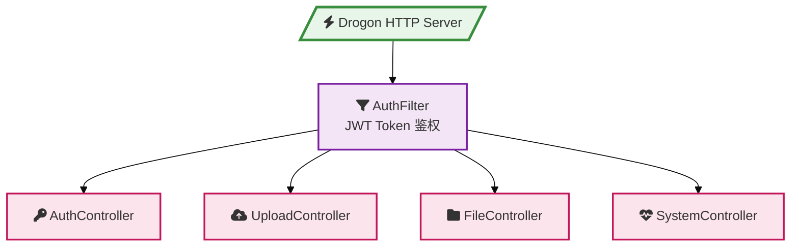
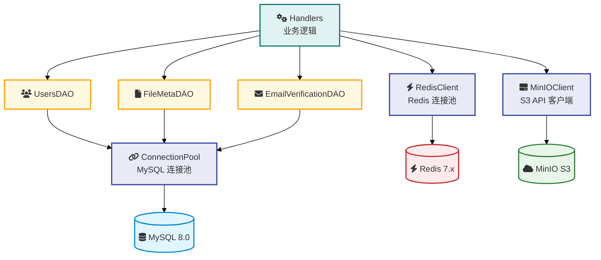
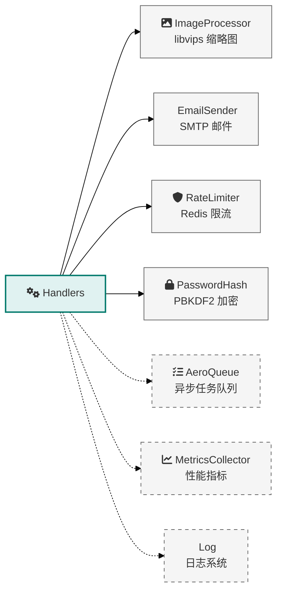
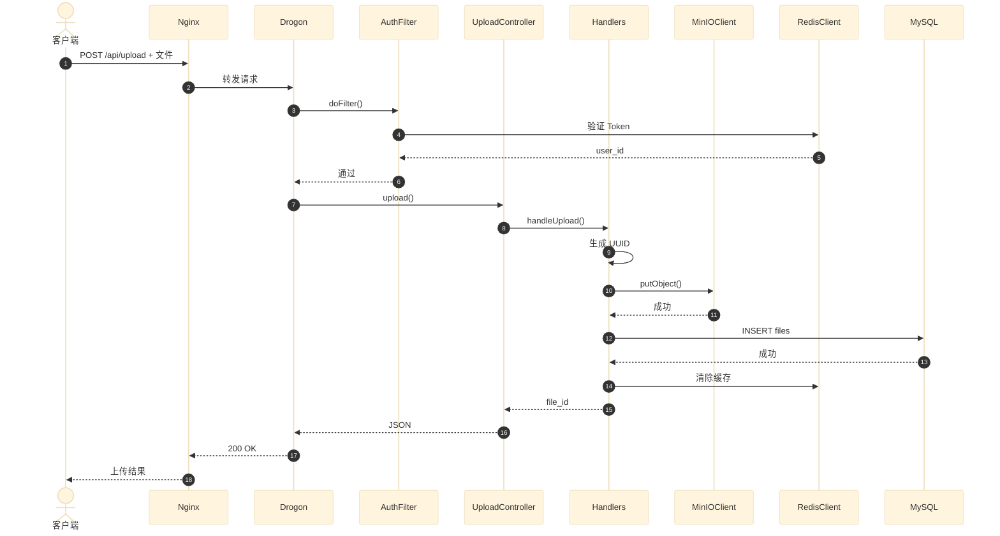
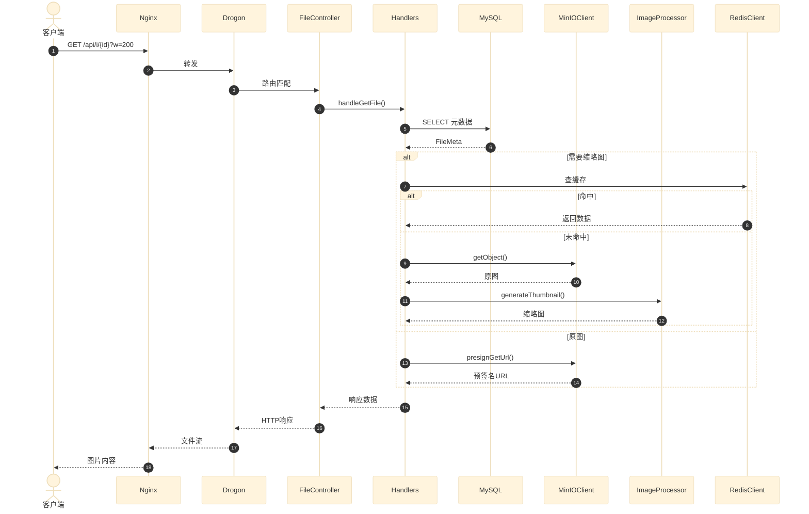
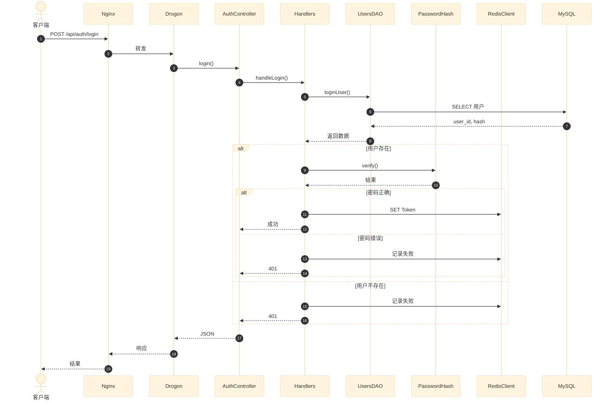
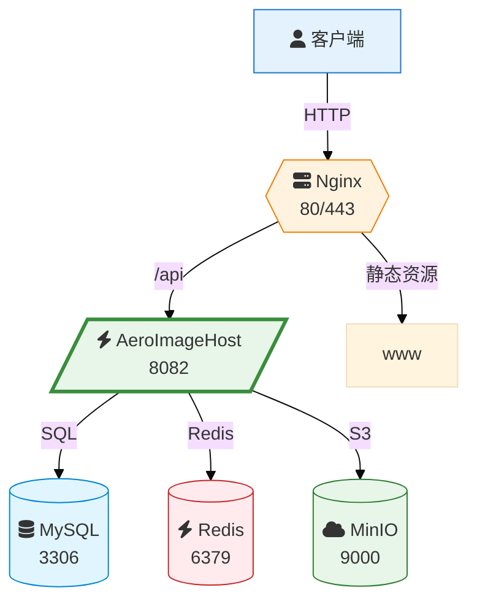
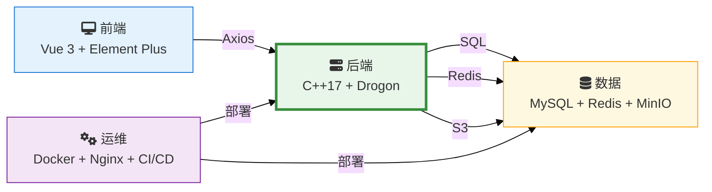

# AeroImageHost 系统架构图

> 基于源码真实结构绘制，所有组件、类名、路由均与代码一致

---

## 1. 系统分层架构图

```mermaid
%%{init: {'theme': 'base', 'themeVariables': { 'fontSize': '16px'}}}%%
graph LR
    Client([fa:fa-user 客户端])
    Nginx{{fa:fa-server Nginx}}
    Drogon[/fa:fa-bolt Drogon/]
    Filters[fa:fa-filter 过滤器层]
    Controllers[fa:fa-gamepad 控制器层]
    Handlers[fa:fa-cogs 业务逻辑层]
    DAO[fa:fa-database DAO层]
    Pools[fa:fa-link 连接池]
    Storage[(fa:fa-hdd 存储)]
    Infra[fa:fa-wrench 基础设施]

    Client -->|HTTP| Nginx
    Nginx -->|反向代理| Drogon
    Drogon --> Filters
    Filters --> Controllers
    Controllers --> Handlers
    Handlers --> DAO
    Handlers --> Infra
    DAO --> Pools
    Pools --> Storage

    style Client fill:#e3f2fd,stroke:#1976d2,stroke-width:2px
    style Nginx fill:#fff3e0,stroke:#f57c00,stroke-width:2px
    style Drogon fill:#e8f5e9,stroke:#388e3c,stroke-width:3px
    style Filters fill:#f3e5f5,stroke:#7b1fa2,stroke-width:2px
    style Controllers fill:#fce4ec,stroke:#c2185b,stroke-width:2px
    style Handlers fill:#e0f2f1,stroke:#00796b,stroke-width:2px
    style DAO fill:#fff8e1,stroke:#ffa000,stroke-width:2px
    style Pools fill:#e8eaf6,stroke:#303f9f,stroke-width:2px
    style Storage fill:#e1f5fe,stroke:#0288d1,stroke-width:2px
    style Infra fill:#f5f5f5,stroke:#616161,stroke-width:1px,stroke-dasharray: 5 5
```

---

## 2. 控制器与路由图

### 路由清单

| 控制器 | 路由 | 方法 | 说明 |
|--------|------|------|------|
| **AuthController** | /api/auth/register | POST | 用户注册 |
| | /api/auth/login | POST | 用户登录 |
| | /api/auth/send-code | POST | 发送邮箱验证码 |
| | /api/auth/email-register | POST | 邮箱验证码注册 |
| **UploadController** | /api/upload | POST | 直接上传文件 |
| | /api/upload/presign | POST | 申请预签名上传 URL |
| | /api/upload/confirm | POST | 确认预签名上传完成 |
| | /api/upload/multipart/init | POST | 初始化分片上传 |
| | /api/upload/multipart/chunk | POST | 上传单个分片 |
| | /api/upload/multipart/complete | POST | 完成分片上传 |
| | /api/upload/multipart/cleanup | POST | 清理分片上传临时数据 |
| **FileController** | /api/files | GET | 获取文件列表 |
| | /api/file/{id} | DELETE | 删除指定文件 |
| | /api/files/batch-delete | POST | 批量删除文件 |
| | /api/file/{id}/public | PUT | 切换公开/私有状态 |
| | /api/file/{id}/presign | GET | 获取预签名下载 URL |
| | /api/share/{id} | GET | 获取文件分享信息 |
| **SystemController** | /api/health | GET | 深度健康检查 |
| | /api/stats | GET | 系统统计信息 |
| | /api/metrics | GET | 性能指标 JSON |
| | /api/cleanup | POST | 触发孤儿分片清理 |

---

## 3. 数据访问层架构

---

## 4. 基础设施组件

---

## 5. 文件上传流程

---

## 6. 文件访问流程

---

## 7. 用户认证流程

---

## 8. 部署架构

---

## 9. 技术栈

