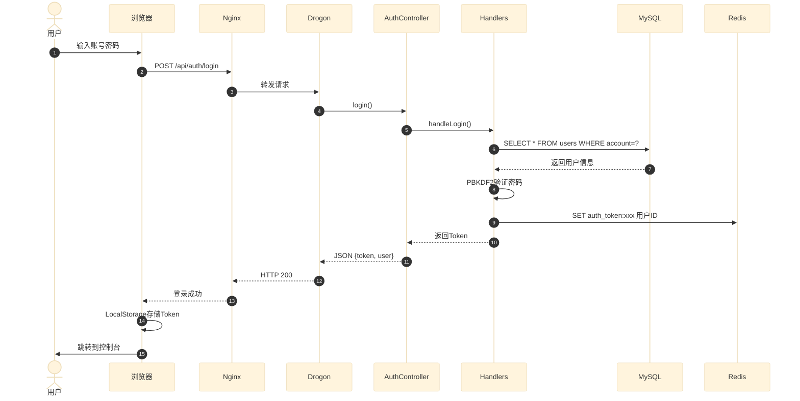
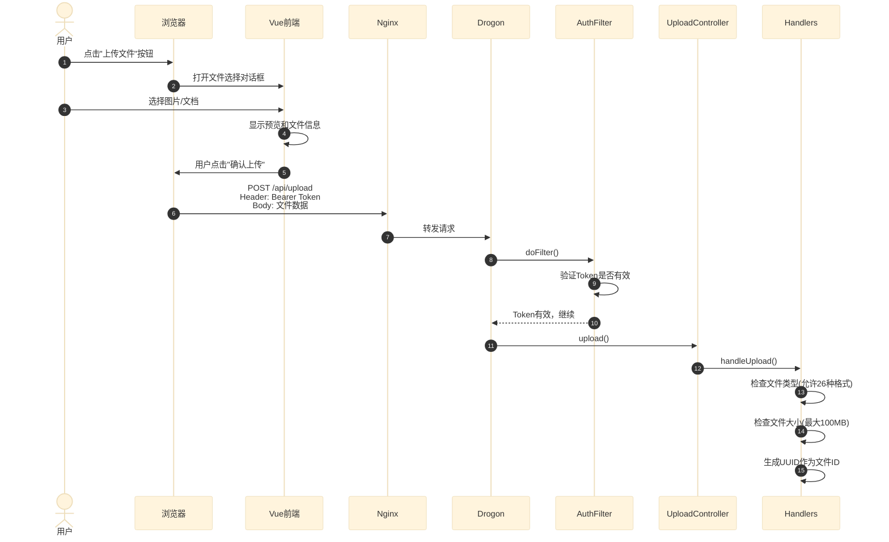
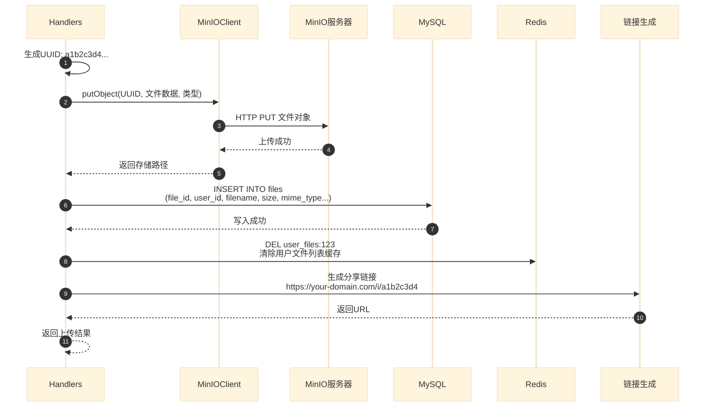
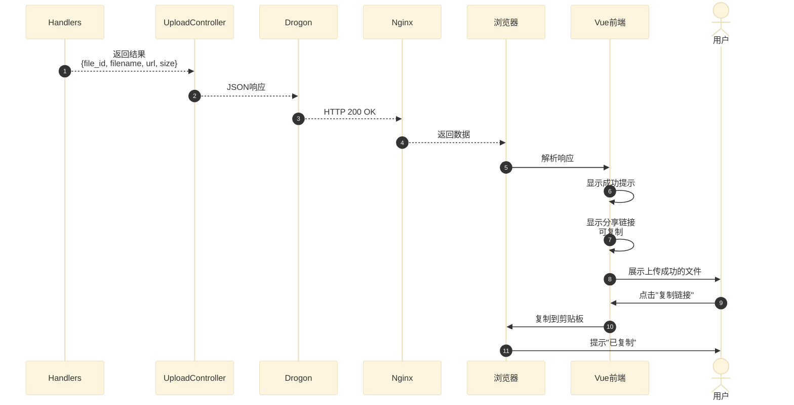
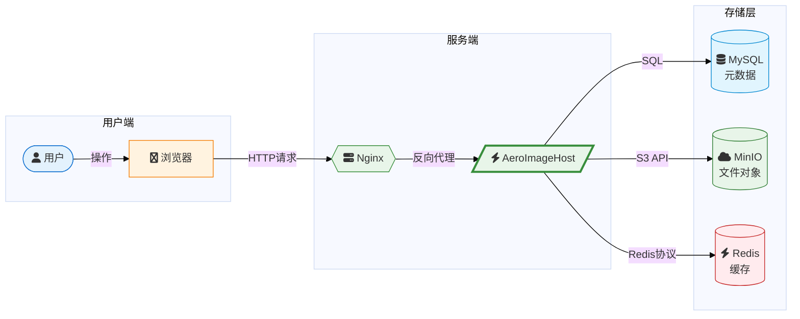

# AeroImageHost 用户使用流程图

> 从登录到上传成功获取分享链接的完整流程

---

## 完整流程：登录 → 上传 → 获取链接

```mermaid
%%{init: {'theme': 'base', 'themeVariables': { 'fontSize': '15px'}}}%%
graph LR
    %% 用户操作
    User([fa:fa-user 用户])
    
    %% 前端界面
    LoginPage[fa:fa-desktop 登录页面]
    Dashboard[fa:fa-dashboard 用户控制台]
    UploadBtn[fa:fa-cloud-upload 点击上传按钮]
    Progress[fa:fa-spinner 上传进度条]
    SuccessPage[fa:fa-check-circle 上传成功页面]
    
    %% 后端处理
    AuthAPI[fa:fa-key 登录API<br/>POST /api/auth/login]
    Token[fa:fa-ticket JWT Token<br/>存储在浏览器]
    UploadAPI[fa:fa-upload 上传API<br/>POST /api/upload]
    FileCheck[fa:fa-shield 文件检查<br/>类型/大小/安全]
    UUID[fa:fa-random 生成唯一ID<br/>UUID v4]
    SaveFile[fa:fa-hdd 保存到MinIO]
    SaveDB[fa:fa-database 记录到MySQL]
    GenLink[fa:fa-link 生成分享链接]
    
    %% 数据存储
    BrowserStorage[(fa:fa-archive 浏览器<br/>LocalStorage)]
    MinIO[(fa:fa-cloud MinIO<br/>文件对象)]
    MySQL[(fa:fa-database MySQL<br/>文件元数据)]
    
    %% 流程连接
    User -->|1.打开网站| LoginPage
    LoginPage -->|2.输入账号密码| AuthAPI
    AuthAPI -->|3.验证成功| Token
    Token -->|4.存储Token| BrowserStorage
    BrowserStorage -->|5.跳转| Dashboard
    Dashboard -->|6.点击| UploadBtn
    UploadBtn -->|7.选择文件| FileCheck
    FileCheck -->|8.文件合法| UUID
    UUID -->|9.开始上传| UploadAPI
    UploadAPI -->|10.保存文件| SaveFile
    SaveFile -->|11.写入| MinIO
    UploadAPI -->|12.记录信息| SaveDB
    SaveDB -->|13.写入| MySQL
    SaveDB -->|14.生成链接| GenLink
    GenLink -->|15.返回结果| SuccessPage
    SuccessPage -->|16.显示链接| User
    
    %% 样式
    style User fill:#e3f2fd,stroke:#1976d2,stroke-width:2px
    style LoginPage fill:#fff3e0,stroke:#f57c00,stroke-width:2px
    style Dashboard fill:#e8f5e9,stroke:#388e3c,stroke-width:2px
    style UploadBtn fill:#fce4ec,stroke:#c2185b,stroke-width:2px
    style Progress fill:#f3e5f5,stroke:#7b1fa2,stroke-width:2px
    style SuccessPage fill:#e0f2f1,stroke:#00796b,stroke-width:2px
    style AuthAPI fill:#fff8e1,stroke:#ffa000,stroke-width:2px
    style Token fill:#e8eaf6,stroke:#303f9f,stroke-width:2px
    style UploadAPI fill:#fff8e1,stroke:#ffa000,stroke-width:2px
    style FileCheck fill:#f3e5f5,stroke:#7b1fa2,stroke-width:2px
    style UUID fill:#e8eaf6,stroke:#303f9f,stroke-width:2px
    style SaveFile fill:#e1f5fe,stroke:#0288d1,stroke-width:2px
    style SaveDB fill:#e1f5fe,stroke:#0288d1,stroke-width:2px
    style GenLink fill:#e8f5e9,stroke:#2e7d32,stroke-width:2px
    style BrowserStorage fill:#f5f5f5,stroke:#616161,stroke-width:1px
    style MinIO fill:#e8f5e9,stroke:#2e7d32,stroke-width:2px
    style MySQL fill:#e1f5fe,stroke:#0288d1,stroke-width:2px
```

---

## 详细步骤说明

### 第一步：用户登录

**关键概念：**
- **JWT Token**：登录成功后服务端生成一个令牌，后续请求都带上它
- **LocalStorage**：浏览器本地存储，刷新页面后Token不会丢失
- **PBKDF2**：密码加密算法，即使数据库泄露也无法反推密码

---

### 第二步：选择文件上传

**关键概念：**
- **文件类型检查**：防止上传可执行文件等危险格式
- **文件大小限制**：防止超大文件耗尽服务器资源
- **UUID**：全球唯一标识符，确保每个文件ID不重复

---

### 第三步：保存文件

**关键概念：**
- **MinIO**：对象存储服务，文件以对象形式存储，支持分布式扩展
- **MySQL**：关系型数据库，存储文件的元信息（谁上传的、什么时候、多大等）
- **Redis缓存清除**：上传新文件后清除旧的文件列表缓存，确保数据一致性

---

### 第四步：返回结果

**关键概念：**
- **分享链接格式**：`https://your-domain.com/i/{file_id}`
- **剪贴板API**：浏览器提供的复制功能，一键复制链接
- **响应式设计**：上传进度实时显示，用户体验友好

---

## 数据流向总结

---

## 时序总览

```mermaid
%%{init: {'theme': 'base', 'themeVariables': { 'fontSize': '14px'}}}%%
gantt
    title 用户登录到上传完成时间线
    dateFormat X
    axisFormat %s秒
    
    section 用户操作
    打开登录页           :0, 1
    输入账号密码         :1, 3
    点击登录            :3, 4
    等待跳转            :4, 5
    点击上传按钮         :5, 6
    选择文件            :6, 8
    确认上传            :8, 9
    等待上传完成         :9, 14
    复制链接            :14, 15
    
    section 后端处理
    验证登录信息         :4, 5
    生成JWT Token       :5, 5
    验证文件            :9, 10
    生成UUID            :10, 10
    保存到MinIO         :10, 12
    写入MySQL           :12, 13
    生成链接            :13, 14
    
    section 网络传输
    登录请求            :4, 5
    登录响应            :5, 5
    上传请求            :9, 10
    文件传输            :10, 12
    上传响应            :14, 14
```

---

## 关键数据表结构

### users 表（用户表）

| 字段 | 类型 | 说明 |
|------|------|------|
| id | INT | 用户ID |
| account | VARCHAR(64) | 登录账号 |
| password_hash | VARCHAR(255) | PBKDF2加密后的密码 |
| email | VARCHAR(128) | 邮箱地址 |
| created_at | DATETIME | 注册时间 |

### files 表（文件表）

| 字段 | 类型 | 说明 |
|------|------|------|
| file_id | VARCHAR(36) | UUID唯一标识 |
| user_id | INT | 上传者ID |
| filename | VARCHAR(255) | 原始文件名 |
| size | BIGINT | 文件大小(字节) |
| mime_type | VARCHAR(128) | 文件类型 |
| is_public | TINYINT | 是否公开(0/1) |
| created_at | DATETIME | 上传时间 |
| view_count | INT | 查看次数 |

---

## 常见问题

**Q: 为什么上传后文件列表没有立即显示？**
A: 因为上传成功后清除了Redis缓存，下次请求时会从MySQL重新加载，有短暂延迟。

**Q: 分享链接有效期多久？**
A: 默认永久有效，除非用户删除文件或设置为私有。

**Q: 私有文件如何分享？**
A: 私有文件需要登录后才能访问，公开文件可以直接通过链接访问。
